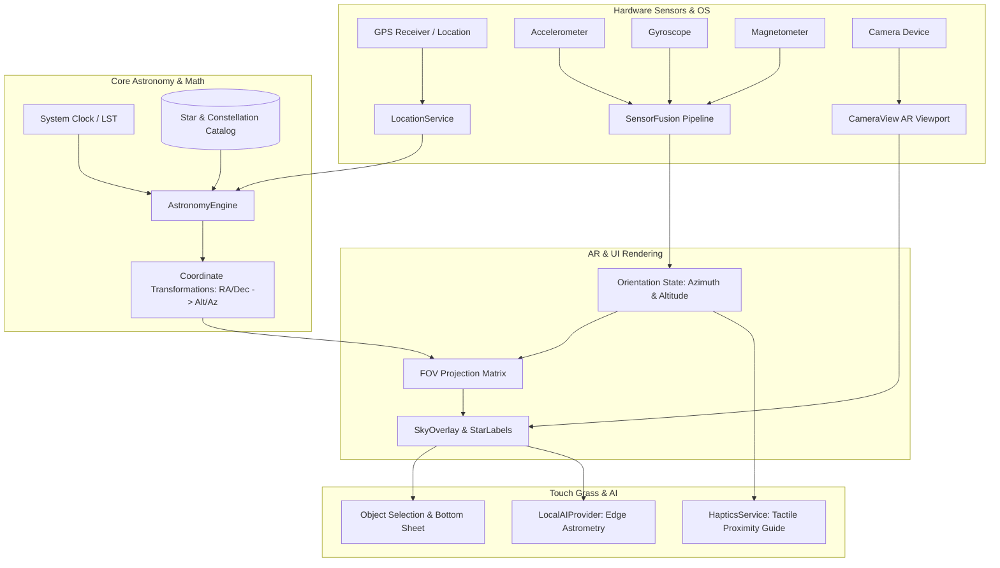

# SkyScout 🔭✨

> **Look up. Discover what's above you.**  
> An open-source, offline-first mobile stargazing companion built for the **Touch Grass Open-Source AI Hackathon**.

SkyScout turns your smartphone into an augmented-reality window onto the night sky. Point your camera at any star or constellation: SkyScout fuses 9-axis motion sensors (Accelerometer, Gyroscope, Magnetometer), GPS, and precise IAU spherical astronomy algorithms to overlay real stars and planets directly over the camera feed. 

Most importantly, SkyScout adheres to the **"Touch Grass" principle**: using tactile haptic guidance to help you lock onto celestial objects, encouraging you to put your phone down and look at the real sky with your naked eyes.

---

## 🌟 Key Features

1. **Live Camera AR Overlay**
   - Full-screen real-time camera viewfinder with field-of-view (FOV) projection.
   - Interactive celestial labels dynamically sized by astronomical magnitude.
   - Constellation asterism outlines (Orion, Ursa Major, Cassiopeia, Gemini, and more).

2. **Real 9-Axis Sensor Fusion (No Fake Values)**
   - **Accelerometer**: Gravity vector decomposition for pitch, roll, and elevation.
   - **Magnetometer**: Compass heading with tilt-compensation.
   - **Gyroscope**: Angular delta velocity integration for low latency.
   - **Complementary & Low-Pass Filtering**: Smooth tracking without label jitter.

3. **Deterministic IAU Astronomy Engine**
   - High-precision calculation of Local Sidereal Time (LST), Right Ascension (RA), and Declination (Dec) into Altitude and Azimuth.
   - Real-time planetary ephemeris for Mercury, Venus, Mars, Jupiter, and Saturn.
   - Solar altitude detection (Daytime warning banner & night stargazing mode).

4. **"Touch Grass" Outdoor Missions**
   - Tactile challenges designed to reduce screen time.
   - Progressive haptic vibrations as you approach targets:
     - `< 10°`: Light vibration pulses.
     - `< 4°`: Medium pulses.
     - `< 1.5°`: Target locked! Success vibration prompts you to lower the screen and view the real star.

5. **Open-Weight Edge AI Astrometry**
   - Pluggable `AIProvider` abstraction (`LocalAIProvider`, `MockAIProvider`).
   - On-device edge reasoning cross-referencing camera optical boresight with candidate star tensors.

6. **100% Offline-First Architecture**
   - Full celestial catalog, ephemeris calculations, and sensor pipeline run locally without requiring internet connectivity.

7. **Developer HUD & Manual Test Bench**
   - Real-time telemetry: Lat/Lon, GPS accuracy, Azimuth, Altitude, Pitch, Roll, Magnetic field confidence, and optical FOV.
   - Manual simulation buttons (Polaris North, Southern sky, Midnight toggle) to verify coordinate projections in any indoor testing setting.
   - Figure-eight compass calibration workflow.

---

## 🏗 Architecture Diagram



---

## 🛠 Tech Stack

- **Framework**: React Native with Expo SDK 57 (TypeScript)
- **Camera**: `expo-camera` (CameraView)
- **Sensors**: `expo-sensors` (Accelerometer, Gyroscope, Magnetometer)
- **Geolocation**: `expo-location`
- **Haptics**: `expo-haptics`
- **Astronomical Math**: `astronomy-engine` & IAU spherical trigonometry
- **Vector Graphics**: `react-native-svg`

---

## 📂 Project Structure

```text
src/
├── ai/
│   ├── AIProvider.ts             # Abstract provider interface
│   ├── LocalAIProvider.ts        # On-device open-weight model simulation
│   └── MockAIProvider.ts         # Diagnostic fallback
├── astronomy/
│   ├── AstronomyEngine.ts        # Ephemeris, planetary positions, solar status
│   ├── CoordinateTransform.ts    # Spherical trigonometry (RA/Dec -> Alt/Az)
│   └── StarCatalog.ts            # J2000 coordinates, magnitudes, and asterisms
├── components/
│   ├── CalibrationModal.tsx      # Figure-eight compass calibration dialog
│   ├── CompassIndicator.tsx      # Cardinal bearing, elevation & confidence HUD
│   ├── DebugOverlay.tsx          # Real-time sensor telemetry & test bench
│   ├── MissionCard.tsx           # Outdoor Touch Grass mission UI
│   ├── ObjectInfoSheet.tsx       # Glassmorphism celestial details sheet
│   └── SkyOverlay.tsx            # Optical FOV projection & star badges
├── hooks/
│   ├── useDeviceOrientation.ts   # Throttled (30Hz) fused orientation hook
│   ├── useLocation.ts            # Observer GPS and offline fallback
│   └── useVisibleStars.ts        # 1Hz memoized celestial ephemeris updates
├── location/
│   └── LocationService.ts        # Expo Location wrapper & reverse geocoding
├── screens/
│   ├── HomeScreen.tsx            # Main launcher & Touch Grass manifesto
│   ├── HowItWorksScreen.tsx      # Explanatory pipeline guide
│   ├── MissionScreen.tsx         # Tactile stargazing mission center
│   ├── SettingsScreen.tsx        # Horizon filters, HUD toggles, calibration
│   └── StargazingScreen.tsx      # Core live camera AR experience
├── sensors/
│   ├── AccelerometerService.ts   # Gravity vector listener
│   ├── GyroscopeService.ts       # Rotational velocity listener
│   ├── HapticsService.ts         # Multi-tiered proximity haptic pulses
│   ├── MagnetometerService.ts    # 3-axis magnetic field listener
│   └── SensorFusion.ts           # 9-axis complementary fusion engine
└── types/
    └── astronomy.ts              # TypeScript definitions
```

---

## 🚀 Getting Started

### Prerequisites
- Node.js 18+ (tested on Node v22.18)
- Android Studio or Xcode (for simulator/device builds) or Expo Go app on a physical device.

### Running the Dev Server
```bash
# Start Expo development server
npx expo start
```

### Android Instructions
1. Run on an Android emulator or connected device:
   ```bash
   npx expo start --android
   ```
2. When prompted on first launch, grant:
   - **Camera permission**
   - **Location (GPS) permission**
3. Open **Developer HUD** in the bottom left to view live sensor telemetry.

### iOS Instructions
1. Run on an iOS simulator or iPhone:
   ```bash
   npx expo start --ios
   ```
2. To test with physical camera and hardware sensors, scan the QR code with your iPhone's camera in the Expo Go app.

---

## 🧪 Indoor Simulation & Test Bench

Testing astronomical tracking indoors is made simple with SkyScout's built-in **Developer HUD**:
1. Tap **🛰️ HUD** on the Stargazing screen.
2. Under **MANUAL TEST BENCH**:
   - Tap **Polaris (N, 89°)**: Verifies that pointing north at 89° altitude centers on the North Star.
   - Tap **South (180°, 35°)**: Verifies winter luminaries such as Sirius and Canis Major.
   - Tap **Time: Midnight (Fixed)**: Temporarily bypasses daytime conditions to preview the midnight sky anytime.
   - Tap **Reset to Live Sensors**: Immediately restores live physical device sensors.

---

## 📄 License
MIT License. Built for the Touch Grass Open-Source AI Hackathon.
